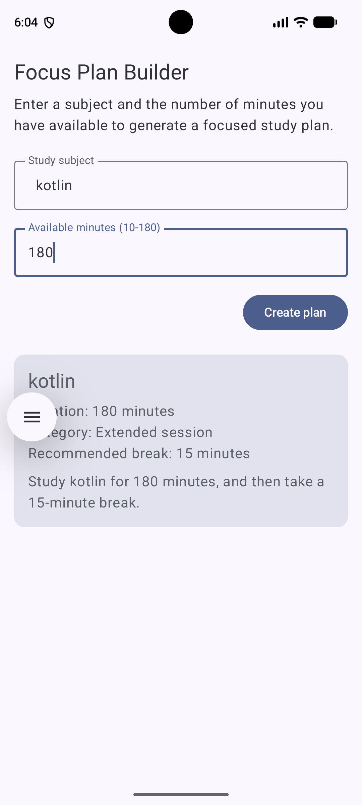

# Focus Plan Builder

**Name:** Patrick Kola
**Assignment:** Focus Plan Builder 

## Description

Focus Plan Builder is a single-screen Android app built with Kotlin and Jetpack
Compose (Material 3). A user enters a study subject and a number of available
minutes (10–180). Once both inputs are valid, the "Create plan" button becomes
enabled. Tapping it generates a study plan showing the subject, duration, a
duration category ("Quick review" / "Focused session" / "Extended session"),
and a recommended break length, along with a plain-language summary sentence.

## Running the app

1. Open the project in Android Studio and let Gradle sync finish.
2. Run on an emulator or physical device (minSdk 26).
3. Enter a subject (e.g. "Compose State") and a duration between 10 and 180
   (e.g. 45), then tap **Create plan**.

## Screenshot

## State and recomposition

`FocusPlanRoute` owns the state (`subject`, `minutesText` via
`rememberSaveable`; `plan` via `remember`), derives `canCreatePlan` on every
recomposition, and builds the `FocusPlan`. `FocusPlanScreen` is stateless,
it only receives values as parameters and reports actions through callbacks.
Whenever `subject`, `minutesText`, or `plan` changes, Compose recomposes only
the parts of the UI that read that piece of state.

## Generative-AI assistance

I used Claude to help me generate comments and help me format my code well so it is easily readable and understandable. It also helped me with writing the README as to making my job more efficient and quicker. Of course, it helped me write it, not answer the questions.

---

### Written answers

**Which composable owns the application state?**
`FocusPlanRoute`. It holds `subject`, `minutesText`, and `plan`.
`FocusPlanScreen` only receives parameters and reports events via callbacks.

**Why are the text-field values stored as String rather than Int?**
Compose text fields always work with `String`, since a user can type partial
or invalid input (empty, letters, a number mid-typing) that an `Int` can't
represent.

**Why is `toIntOrNull()` safer than `toInt()` for this application?**
`toInt()` throws and crashes on invalid input. `toIntOrNull()` returns `null`
instead, so invalid input just disables the button with no crash risk.

**What state change causes the button to be recomposed?**
Any change to `subject` or `minutesText` — since `canCreatePlan` is derived
from both on every recomposition, the `Button`'s `enabled` value updates
automatically.

**What does `rememberSaveable` preserve that a local variable would not?**
It writes the value into the saved-instance-state `Bundle`, so `subject` and
`minutesText` survive rotation and process death. A local variable (or plain
`remember`) would be lost when the Activity is recreated.
